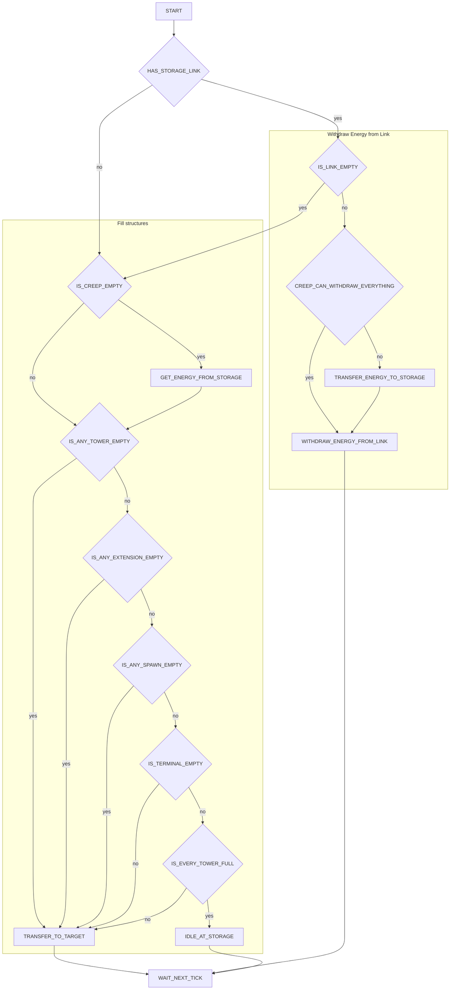

Courier Creep Role
============

# Introduction

Courier is our creep to take energy from `Storage` and `Link`s and fill our structures (i.e. `Spawn`, `Extensions` and `Towers`).

```mermaid
graph TD;
    START --> HAS_STORAGE_LINK{HAS_STORAGE_LINK}
    HAS_STORAGE_LINK -- yes --> IS_LINK_EMPTY{IS_LINK_EMPTY}
    HAS_STORAGE_LINK -- no --> IS_CREEP_EMPTY{IS_CREEP_EMPTY}
    IS_LINK_EMPTY -- yes --> IS_CREEP_EMPTY
    subgraph Withdraw Energy from Link
        IS_LINK_EMPTY -- no --> CREEP_CAN_WITHDRAW_EVERYTHING{CREEP_CAN_WITHDRAW_EVERYTHING}
        CREEP_CAN_WITHDRAW_EVERYTHING -- no --> TRANSFER_ENERGY_TO_STORAGE
        CREEP_CAN_WITHDRAW_EVERYTHING -- yes --> WITHDRAW_ENERGY_FROM_LINK
        TRANSFER_ENERGY_TO_STORAGE --> WITHDRAW_ENERGY_FROM_LINK
    end
    subgraph Fill structures
        IS_CREEP_EMPTY -- no --> IS_ANY_TOWER_EMPTY{IS_ANY_TOWER_EMPTY}
        IS_CREEP_EMPTY -- yes --> GET_ENERGY_FROM_STORAGE
        GET_ENERGY_FROM_STORAGE --> IS_ANY_TOWER_EMPTY{IS_ANY_TOWER_EMPTY}
        IS_ANY_TOWER_EMPTY -- no --> IS_ANY_EXTENSION_EMPTY{IS_ANY_EXTENSION_EMPTY}
        IS_ANY_TOWER_EMPTY -- yes --> TRANSFER_TO_TARGET
        IS_ANY_EXTENSION_EMPTY -- no --> IS_ANY_SPAWN_EMPTY{IS_ANY_SPAWN_EMPTY}
        IS_ANY_EXTENSION_EMPTY -- yes --> TRANSFER_TO_TARGET
        IS_ANY_SPAWN_EMPTY -- no --> IS_TERMINAL_EMPTY{IS_TERMINAL_EMPTY}
        IS_ANY_SPAWN_EMPTY -- yes --> TRANSFER_TO_TARGET
        IS_TERMINAL_EMPTY -- no --> IS_EVERY_TOWER_FULL{IS_EVERY_TOWER_FULL}
        IS_TERMINAL_EMPTY -- no --> TRANSFER_TO_TARGET
        IS_EVERY_TOWER_FULL -- no --> TRANSFER_TO_TARGET
        IS_EVERY_TOWER_FULL -- yes --> IDLE_AT_STORAGE
    end
    TRANSFER_TO_TARGET --> WAIT_NEXT_TICK
    WITHDRAW_ENERGY_FROM_LINK --> WAIT_NEXT_TICK
    IDLE_AT_STORAGE --> WAIT_NEXT_TICK
```
